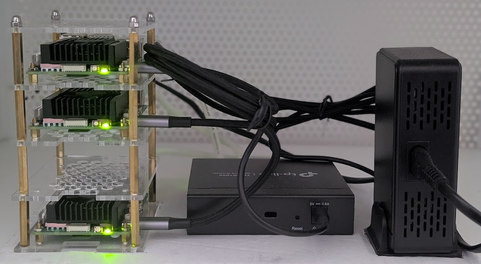
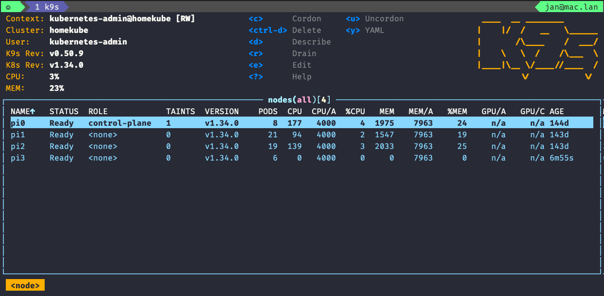
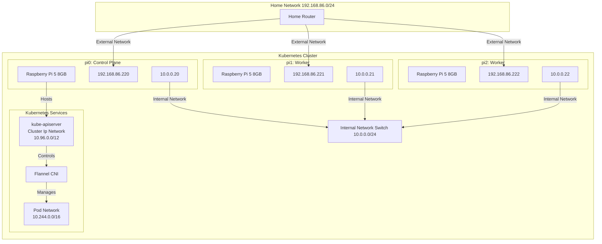
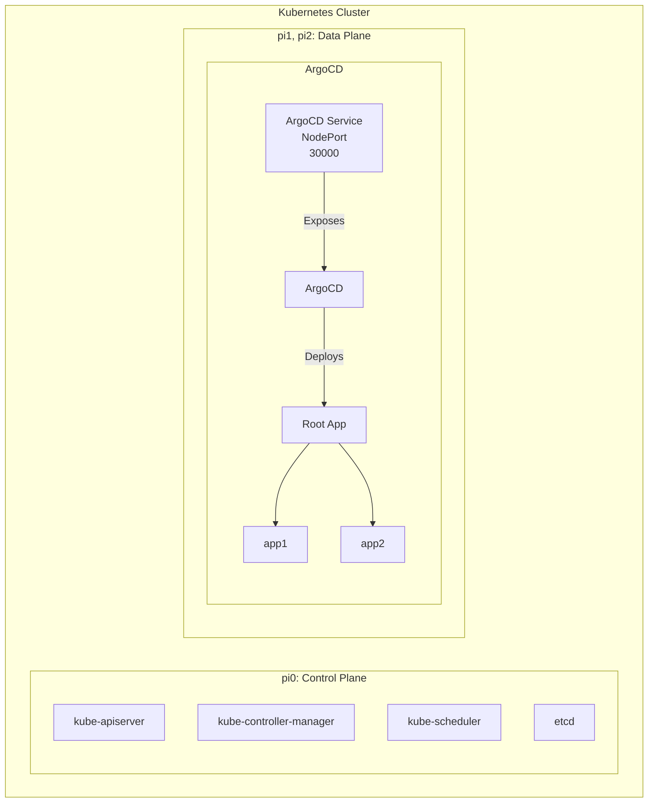

# Homekube

Running Upstream Kubernetes on Raspberry Pi.

---

  
  
  
  

---

---

---

<!-- TOC -->
- [Overview](#overview)
- [Documentation / Notes](#documentation--notes)
- [References / Inspiration](#thanks--references--inspiration)
<!-- /TOC -->

---

## Overview

### Components
| Component | Package | Version |
|-|-|-|
| Kubernetes | `k8s` | _1.31.6_ |
| CRI | `containerd` | _2.0.0_ |
| | `runc` | _1.1.5_ |
| CNI | `flannel` | _0.26.4_ |
| | `containernetworking-plugins` | _1.1.1_ |
| CSI | `longhorn` | tbd |

### Nodes

| Hostname | Device | OS | Static IP | Internal IP |
|-|-|-|-|-|
| pi0 | Raspberry Pi 5, 8GB | Raspberry Pi OS Lite 64-bit | 192.168.86.220 | 10.0.0.20 |
| pi1 | Raspberry Pi 5, 8GB | Raspberry Pi OS Lite 64-bit | 192.168.86.221 | 10.0.0.21 | 
| pi2 | Raspberry Pi 5, 8GB | Raspberry Pi OS Lite 64-bit | 192.168.86.222 | 10.0.0.22 |

### Kubernetes Network Architecture

### Kubernetes Cluster Architecture

### Details

See [Configuration & Logs](./doc/01_conf_logs.md).

## Setup

⚠️ The following steps outline the tasks required to install Kubernetes on _my_ Raspberry Pi cluster. It's likely that _your_ cluster is  different. Use this repository as a guide, but don't expect every step to work for your system.

1. [Environment preparation](./doc/02_env_preparation.md) (manual)
2. [Node configuration](./doc/02_node_configuration.md) (Ansible)
3. [Kubernetes installation](./doc/02_kube_installation.md) (kubeadm, semi-manual)
4. [ArgoCD rollout & App of Apps deployment](./doc/02_argo_rollout.md) (OpenTofu/tf)
5. [ArgoCD applications repository](https://github.com/jangroth/homekube-apps)

## References / Inspiration

- ['Kubernetes the hard way'](https://github.com/kelseyhightower/kubernetes-the-hard-way/tree/master) - Kelsey Hightower
- ['How to install Kubernetes on Raspberry PI'](https://medium.com/karlmax-berlin/how-to-install-kubernetes-on-raspberry-pi-53b4ce300b58) - Ralph Bergmann
- [Kubernetes documentation](https://kubernetes.io/docs/setup/production-environment/)
