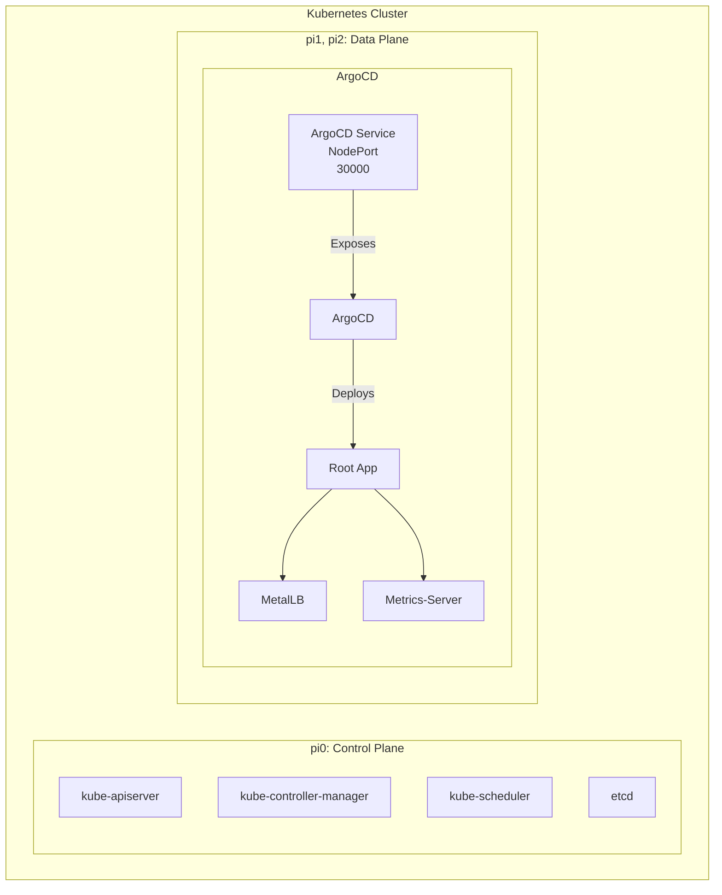

# Homekube

Running Upstream Kubernetes on Raspberry Pi.

---

<div style="display: flex; justify-content: space-around;">
  
  
  
  
</div>

---

<div style="display: flex; justify-content: space-around;">
  
</div>

---


---


---

<!-- TOC -->
* [Overview](#overview)
* [Setup](#setup)
* [References / Inspiration](#references--inspiration)
<!-- /TOC -->

---

## Overview

### Components

| Component | Package | Version |
|-|-|-|
| Kubernetes | `k8s` | _1.34.0_ |
| CRI | `containerd` | _2.1.4_ |
| | `runc` | _1.1.5_ |
| CNI | `cilium` | _1.18.1_ |
| | `containernetworking-plugins` | _1.1.1_ |
| CSI | `longhorn` | _1.9.1_ |

### Nodes

| Hostname | Device | OS | Architecture | Static IP | Internal IP |
|-|-|-|-|-|-|
| pi0 | Raspberry Pi 5, 8GB | Raspberry Pi OS Lite 64-bit | aarch64 | 192.168.86.220 | 10.0.0.20 |
| pi1 | Raspberry Pi 5, 8GB | Raspberry Pi OS Lite 64-bit | aarch64 | 192.168.86.221 | 10.0.0.21 |
| pi2 | Raspberry Pi 5, 8GB | Raspberry Pi OS Lite 64-bit | aarch64 | 192.168.86.222 | 10.0.0.22 |
| pi3 | Raspberry Pi 5, 8GB | Raspberry Pi OS Lite 64-bit | aarch64 | 192.168.86.223 | 10.0.0.23 |

### Kubernetes Network Architecture

| Network | CIDR | Component |
|-|-|-|
| Pod Network | 10.244.0.0/16 | kubeadm / ClusterConfiguration |
| Service Network | 10.96.0.0/12 | kubeadm / ClusterConfiguration |
| Cluster DNS | 10.96.0.10 | kubeadm / KubeletConfiguration |
| Cilium Pod Network | 10.244.0.0/16 | cilium |

### Kubernetes Cluster Architecture



### Details

See [Configuration & Logs](./doc/01_conf_logs.md).

## Setup

⚠️ The following steps outline the tasks required to install Kubernetes on _my_ Raspberry Pi cluster. It's likely that _your_ cluster is  different. Use this repository as a guide, but don't expect every step to work for your system. ⚠️

1. [Node configuration](./doc/02_01_node-configuration.md) (Ansible)
2. [Kubernetes installation](./doc/02_02_kube_installation.md) (kubeadm, semi-manual)
3. [ArgoCD rollout & App of Apps deployment](./doc/02_03_argo_rollout.md) (Ansible & ArgoCD)
4. [ArgoCD application notes](https://github.com/jangroth/homekube-apps)

### Quick update

```shell
ansible-playbook 01-update-control-node.yml --tags update-only
ansible-playbook 03-setup-k8s-nodes.yml --tags update-only
```

## References / Inspiration

* ['Kubernetes the hard way'](https://github.com/kelseyhightower/kubernetes-the-hard-way/tree/master) - Kelsey Hightower
* ['How to install Kubernetes on Raspberry PI'](https://medium.com/karlmax-berlin/how-to-install-kubernetes-on-raspberry-pi-53b4ce300b58) - Ralph Bergmann
* [Kubernetes documentation](https://kubernetes.io/docs/setup/production-environment/)
* [Pi Kubernetes Cluster](https://picluster.ricsanfre.com/docs/home/)
