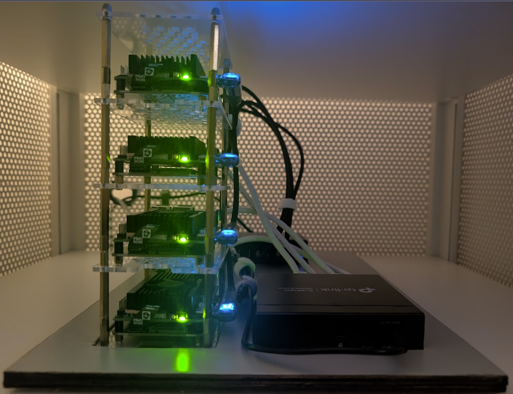
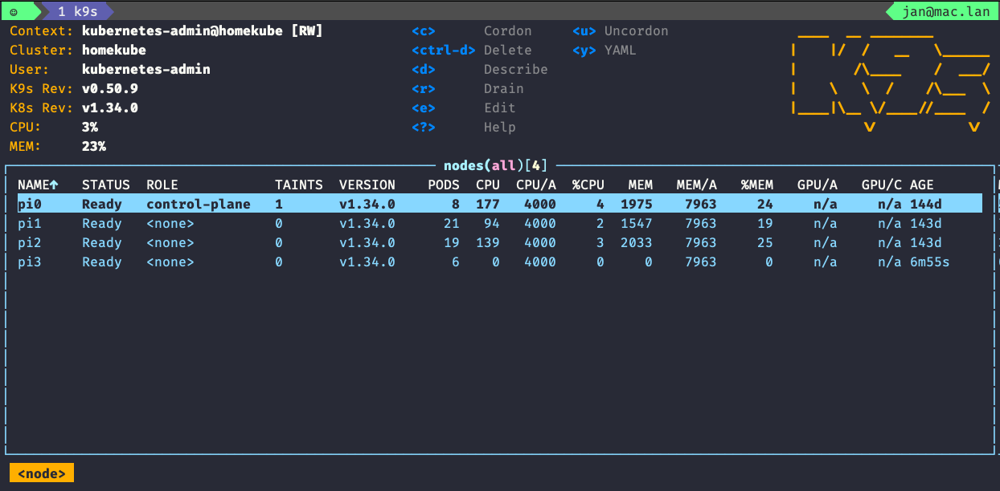
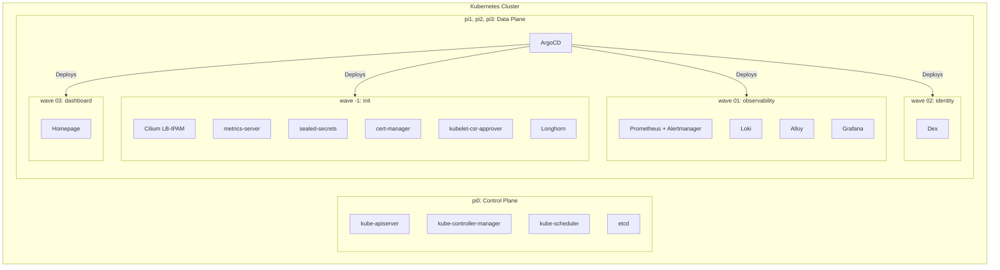
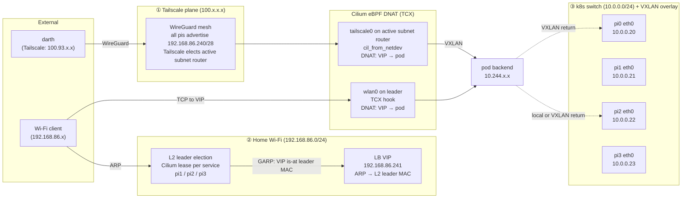

# homekube

Workspace for running vanilla Kubernetes on 4x Raspberry Pi 5.

---



---

<div style="display: flex; justify-content: space-around;">
  
  
  
</div>

---

<div style="display: flex; justify-content: space-around;">
  
  
  
</div>

---
<div style="display: flex; justify-content: space-around;">
  
  
</div>

---



---

## Getting Started

Clone this repo first, then the two sub-repos into it:

```bash
# Using gh (recommended)
gh repo clone jangroth/homekube
cd homekube
gh repo clone jangroth/homekube-main
gh repo clone jangroth/homekube-apps

# Using git
git clone https://github.com/jangroth/homekube.git
cd homekube
git clone https://github.com/jangroth/homekube-main.git
git clone https://github.com/jangroth/homekube-apps.git
```

## Repos

| Repo | Purpose |
|------|---------|
| [homekube](https://github.com/jangroth/homekube) | This repo — workspace root, decisions, specs, todos |
| [homekube-main](https://github.com/jangroth/homekube-main) | Ansible provisioning, k8s install, ArgoCD bootstrap |
| [homekube-apps](https://github.com/jangroth/homekube-apps) | ArgoCD applications (App-of-Apps) |

## Cluster

| Hostname | Role | Device | OS | Architecture | Boot | Tailscale | k8s IP |
|----------|------|--------|-----|--------------|------|-----------|--------|
| pi0 | Control Plane | RPi 5, 8GB | Raspberry Pi OS Lite 64-bit | aarch64 | NVMe | pi0 | 10.0.0.20 |
| pi1 | Data Plane | RPi 5, 8GB | Raspberry Pi OS Lite 64-bit | aarch64 | NVMe | pi1 | 10.0.0.21 |
| pi2 | Data Plane | RPi 5, 8GB | Raspberry Pi OS Lite 64-bit | aarch64 | NVMe | pi2 | 10.0.0.22 |
| pi3 | Data Plane | RPi 5, 8GB | Raspberry Pi OS Lite 64-bit | aarch64 | NVMe | pi3 | 10.0.0.23 |

1TB NVMe each. **Access:** all management via Tailscale (100.x.x.x MagicDNS). Physical switch (10.0.0.x) for inter-pi k8s traffic only — Tailscale is invisible to Kubernetes.

### Kubernetes Network Architecture

| Network | CIDR | Component |
|-|-|-|
| Pod Network | 10.244.0.0/16 | kubeadm / ClusterConfiguration + Cilium |
| Service Network | 10.96.0.0/12 | kubeadm / ClusterConfiguration |
| Cluster DNS | 10.96.0.10 | kubeadm / KubeletConfiguration |
| LB VIP pool | 192.168.86.241–251 | Cilium LB-IPAM (`CiliumLoadBalancerIPPool`) |

### Kubernetes Cluster Architecture


```mermaid
graph TD
    subgraph Kubernetes Cluster
        subgraph ControlPlane [pi0: Control Plane]
            API[kube-apiserver]
            Cont_manager[kube-controller-manager]
            Scheduler[kube-scheduler]
            Etcd[etcd]
        end

        subgraph DataPlane [pi1, pi2, pi3: Data Plane]
            subgraph WaveInit["wave -1: init"]
                cilium_lb[Cilium LB-IPAM]
                metrics[metrics-server]
                sealed[sealed-secrets]
                certmgr[cert-manager]
                csr[kubelet-csr-approver]
                longhorn[Longhorn]
            end
            subgraph Wave01["wave 01: observability"]
                prom[Prometheus + Alertmanager]
                loki[Loki]
                alloy[Alloy]
                grafana[Grafana]
            end
            subgraph Wave02["wave 02: identity"]
                dex[Dex]
            end
            subgraph Wave03["wave 03: dashboard"]
                homepage[Homepage]
            end
            argocd[ArgoCD]
        end
    end

    argocd -- Deploys --> WaveInit
    argocd -- Deploys --> Wave01
    argocd -- Deploys --> Wave02
    argocd -- Deploys --> Wave03
```

### Network Architecture

Three independent network planes serve different purposes:


```mermaid
graph LR
    subgraph external[External]
        darth["darth\n(Tailscale: 100.93.x.x)"]
        wificlient["Wi-Fi client\n(192.168.86.x)"]
    end

    subgraph plane_ts["① Tailscale plane (100.x.x.x)"]
        ts_mesh["WireGuard mesh\nall pis advertise 192.168.86.240/28\nTailscale elects active subnet router"]
    end

    subgraph plane_wifi["② Home Wi-Fi (192.168.86.0/24)"]
        vip["LB VIP\n192.168.86.241\nARP → L2 leader MAC"]
        l2["L2 leader election\nCilium lease per service\npi1 / pi2 / pi3"]
    end

    subgraph plane_switch["③ k8s switch (10.0.0.0/24)  +  VXLAN overlay"]
        pi0_eth["pi0 eth0\n10.0.0.20"]
        pi1_eth["pi1 eth0\n10.0.0.21"]
        pi2_eth["pi2 eth0\n10.0.0.22"]
        pi3_eth["pi3 eth0\n10.0.0.23"]
    end

    subgraph dnat["Cilium eBPF DNAT (TCX)"]
        dnat_ts["tailscale0 on active subnet router\ncil_from_netdev\nDNAT: VIP → pod"]
        dnat_wlan["wlan0 on leader\nTCX hook\nDNAT: VIP → pod"]
    end

    pod["pod backend\n10.244.x.x"]

    darth -->|WireGuard| ts_mesh
    ts_mesh --> dnat_ts
    dnat_ts -->|VXLAN| pod

    wificlient -->|ARP| l2
    l2 -->|GARP: VIP is-at leader MAC| vip
    wificlient -->|TCP to VIP| dnat_wlan
    dnat_wlan --> pod

    pod -.->|VXLAN return| pi0_eth
    pod -.->|local or VXLAN return| pi2_eth
```

**Tailscale path** (reliable): darth → WireGuard → active subnet router (any pi, `tailscale0`) → Cilium DNAT → pod. Return via VXLAN if pod is on a different node.

**Wi-Fi path** (best-effort): client ARPs for VIP → L2 leader (one of pi1/2/3, elected via Kubernetes lease) responds with its `wlan0` MAC → client sends TCP to leader's `wlan0` → Cilium TCX hook DNATs to pod. Intermittently disrupted by wireless link variability and Cilium BPF reload windows.

## Stack

Cilium (CNI + LB) · Longhorn · ArgoCD · Prometheus · Grafana · Loki

## Components & Versions

### Base system (Ansible-installed)

| Component | Package | Version |
|-|-|-|
| Kubernetes | `k8s` | 1.36.1 |
| CRI | `containerd` | 2.3.0 |
| | `runc` | apt-provided, unpinned |
| CNI | `cilium` | 1.19.4 |
| | `containernetworking-plugins` | apt-provided, unpinned |

### ArgoCD-deployed workloads

> ArgoCD itself is installed via Ansible (`homekube-main`), not managed here.

| Component | Namespace | Wave | Chart Version | Access |
|-----------|-----------|------|---------------|--------|
| Cilium LB-IPAM + L2 | `kube-system` | -1 | — (CRs only) | VIP pool `192.168.86.241–251` |
| ArgoCD config | `argocd` | -1 | — | `192.168.86.241:80` |
| metrics-server | `kube-system` | -1 | 3.12.2 | `kubectl top` |
| sealed-secrets | `kube-system` | -1 | 2.19.1 | `kubeseal` CLI |
| cert-manager | `cert-manager` | -1 | 1.20.2 | `ClusterIssuer/homekube-ca` |
| kubelet-csr-approver | `kube-system` | -1 | 1.2.14 | automatic CSR approval |
| Longhorn | `longhorn-system` | -1 | 1.11.2 | `192.168.86.242:80` |
| kube-prometheus-stack (Prometheus + Alertmanager) | `observability` | 01 | 87.0.1 | Prometheus `:30002`, Alertmanager `:30004` |
| Loki | `observability` | 01 | 7.0.0 | internal (`observability` svc) |
| Alloy | `observability` | 01 | 1.8.1 | DaemonSet log shipper |
| Grafana | `observability` | 01 | (kube-prometheus subchart) | `192.168.86.243:443` |
| Dex | `dex` | 02 | 0.24.1 | `192.168.86.244:5556` (LAN), `https://pi0.taild13083.ts.net/dex` (browser/OIDC) |
| Homepage | `homepage` | 03 | — (raw manifests, image v1.13.2) | `192.168.86.245:80` |

Keep both tables current in the same piece of work as any version bump, new component, or resize — see "source reflects runtime" in `CLAUDE.md`.

## Resource Budget

Rough RAM allocation, sized for 4×8 GiB = 32 GiB total. Numbers are `requests`; `limits` set 1.5–2× for burst headroom. System reserved (kubelet/containerd/Cilium/CoreDNS/sealed-secrets/cert-manager) ≈ 1 GiB/node = 4 GiB. Anything above is workload budget.

### Deployed

| Capability | Component | RAM request | Notes |
|---|---|---|---|
| 1 | sealed-secrets controller | 64 MiB | |
| 2 | cert-manager (3 pods) | 256 MiB | |
| 3 | kubelet-csr-approver | 64 MiB | |
| 4 | MetalLB (controller + speakers ×4) | 256 MiB | |
| 5 | Longhorn (manager+driver+engines, all nodes) | 1.8 GiB | manager + CSI sidecars now have explicit requests (#8); `instance-manager` remains ungoverned (chart limitation) and is the actual growth driver as volumes attach |
| 6 | Prometheus | 2 GiB | retention 15d / 40 GiB |
| 6 | Alertmanager | 128 MiB | |
| 6 | kube-state-metrics | 128 MiB | |
| 6 | node-exporter ×4 | 256 MiB | |
| 6 | prometheus-operator (+ config-reloader sidecars) | 192 MiB | operator 128 MiB + config-reloader sidecar shared by Prometheus/Alertmanager pods, 2×32 MiB (#9) |
| 7 | Loki (monolithic) | 1 GiB | filesystem backend on Longhorn PVC; limit 2 GiB |
| 7 | Alloy ×4 | 512 MiB | main container limit 384 MiB; includes configReloader sidecar, 32 MiB request / 64 MiB limit (#9) |
| 7 | Loki sidecar (loki-sc-rules) | 64 MiB | limit 192 MiB (#9) |
| 8 | Grafana | 384 MiB | includes sc-dashboard + sc-datasources sidecars, limit 192 MiB each (#9); download-dashboards init container not counted (transient, doesn't add to steady-state request) |
| 9 | Dex | 128 MiB | |
| — | **Subtotal (deployed)** | **~7.2 GiB** | |

### Planned

| Capability | Component | RAM request | Notes |
|---|---|---|---|
| 10 | Istio (istiod + gateway, no sidecars) | 1 GiB | sidecars budgeted per opt-in namespace |
| 11 | Velero | 256 MiB | |
| — | **Subtotal (planned)** | **~1.25 GiB** | |

### Headroom

| | RAM |
|---|---|
| System reserved (4 nodes) | ~4 GiB |
| Deployed workload subtotal | ~7.2 GiB |
| **Current headroom** | **~20.8 GiB** |
| Planned workload subtotal | ~1.25 GiB |
| **Headroom after planned deploys** | **~19.55 GiB** |

Sidecar overhead is *not* in either subtotal — each opted-in namespace adds ~80–120 MiB per pod. Audit before enabling injection in a busy namespace.

Update this table in the same piece of work whenever a workload's resource requests/limits change (new component, resize, removal) — see "source reflects runtime" in `CLAUDE.md`.

## References / Inspiration

* [Kubernetes the hard way](https://github.com/kelseyhightower/kubernetes-the-hard-way/tree/master) - Kelsey Hightower
* [Pi Kubernetes Cluster](https://picluster.ricsanfre.com/docs/home/) - Ricardo Sanchez
* [k8s-gitops](https://github.com/xunholy/k8s-gitops) - Michael Fornaro

## Navigation

- [GitHub Issues](https://github.com/jangroth/homekube/issues) — open tasks (single tracker for all three repos)
- [`DECISIONS.md`](DECISIONS.md) — decision log
- [`docs/specs/`](docs/specs/) — specs for significant work items
